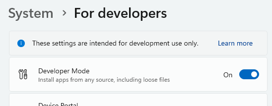
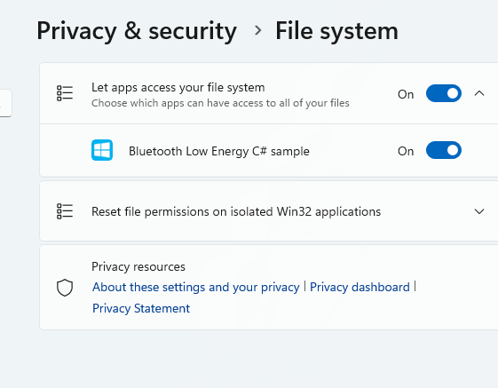
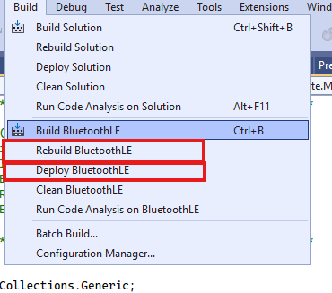

# BLE-Data-Exfiltration
A tiny tool to transfer files from and to a client via web bluetooth. Designed to interact with a target laptop during an assume breach red teaming.
There is a server to install on your system and website to call on the "client" (target system). From the website you can read or write files to the client.
I tried to develop it performant, but it is still preatty slow (a bit over 5mb / min).

## Using the Release

Set your "server" (any Windows System, BLE had issues for me with connecting to the service when running within a VM) to developer mode

Install the App:
1) Download the release and unpack the ZIP
2) Set your Windows into "Developer Mode"

3) Install the Package: Add-AppxPackage .\BluetoothLE_0.1.1.0_x86_x64.msixbundle -AllowUnsigned
4) Allow the UWP App to store local files (Details see chapter settings: https://www.jasongaylord.com/blog/2021/11/17/uwp-file-access-denied).

5) On the client: Navigate to  https://rafaelscheel.github.io/BLE-Data-Exfiltration/client.html (the code is in the docs folder) in Chrome or Edge. Web Bluetooth can be disabled by policy: https://learn.microsoft.com/en-us/deployedge/microsoft-edge-browser-policies/defaultwebbluetoothguardsetting 

## Run Server from Visual Studio

It is recomended to run the Windows Universal Platform App from within VS. 

1) Build -> Rebuild BluetoothLE (not the Solution!)
2) Build -> Deoploy BluetoothLE (this installs the App on your computer)
3) Start with or without debugging. Without debugging will help the file transfer performance.

## File Read
The file transfer to the client is currently synchronus and thus extremly slow (send a read of a junk -> wait for an answer -> repeat).
1) Start the server
2) Load the file into the server (Click "Send File")
3) Start the client and connect to the server
4) Read the file (Click read file -> Wil be downloaded)